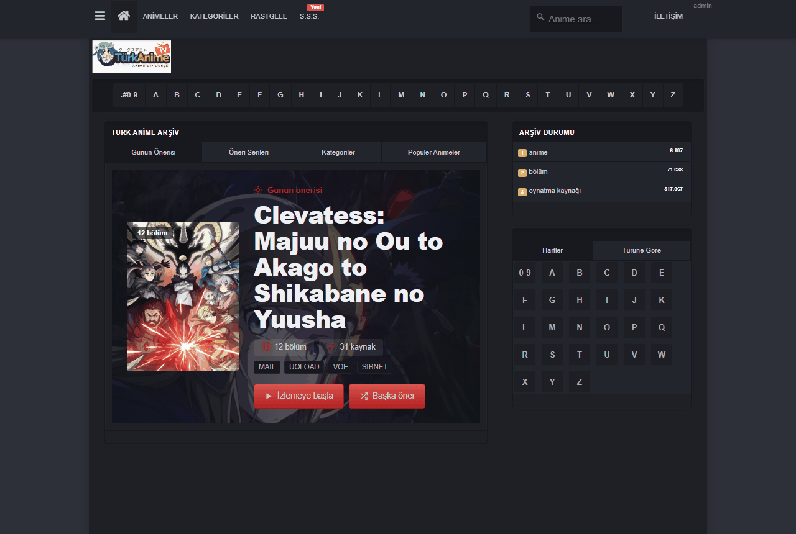
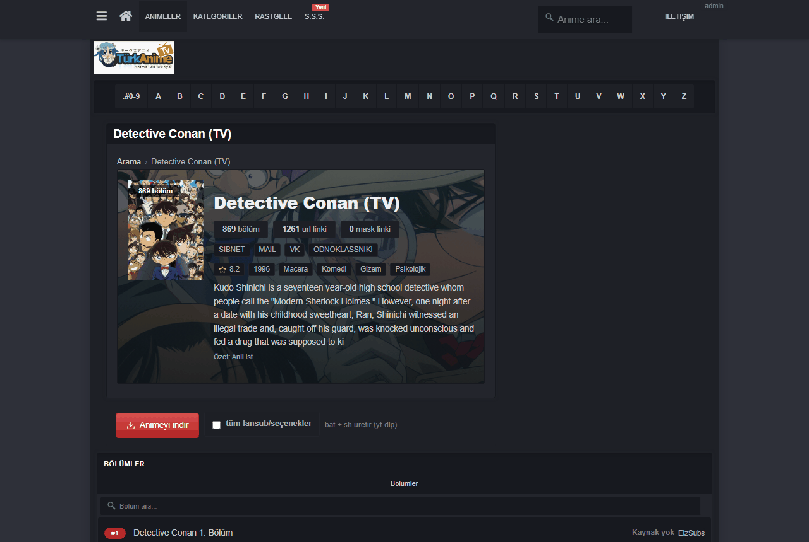
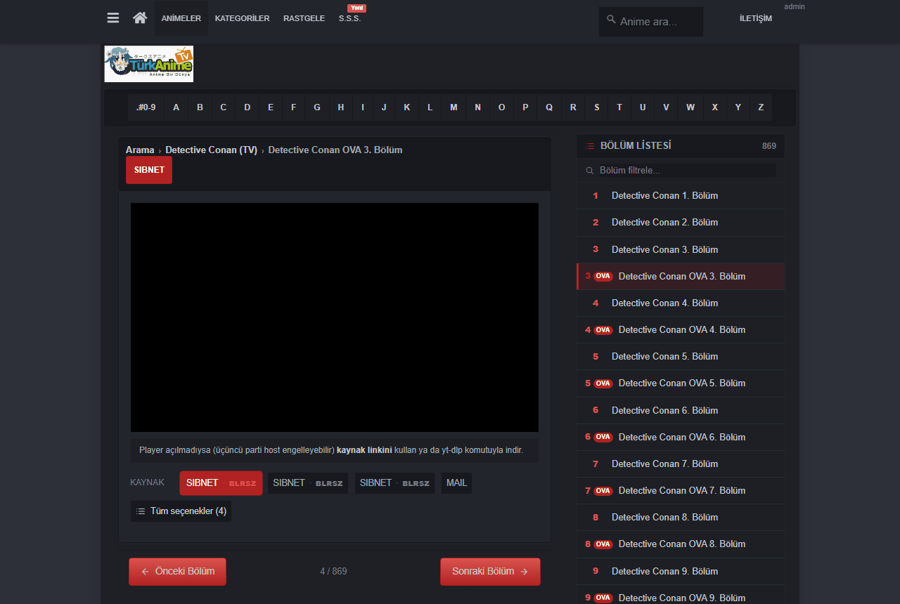
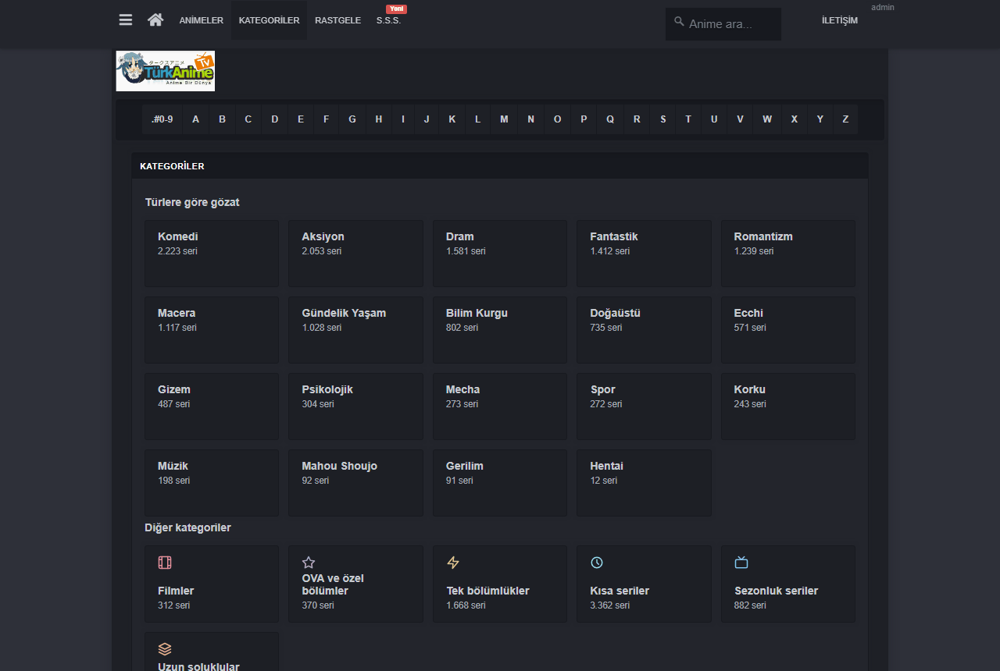

<div align="center">

# TurkAnimeTV Arşiv

**turkanime.tv kapanınca arkasında devasa bir arşiv bıraktı. Bu proje, o arşivi kurtarmak ve erişilebilir kılmak amacıyla başlatıldı. Tamamen statik ve sunucusuz (Github-page üzerinden) çalışan izleme sitemizde 6.107 anime ve 317.067 video linki bulunuyor. Ayrıca projede yalnızca videoları değil; animelerin isimlerini, bölümlerin linklerini, fansub gruplarının ve çevirmenlerin bilgilerini açık bir şekilde veritabanında sunuyoruz.**

[](https://nutaliaxd.github.io/TurkAnimeTV_Arsiv/)
[](https://nutaliaxd.github.io/TurkAnimeTV_Arsiv/)
[](https://nutaliaxd.github.io/TurkAnimeTV_Arsiv/)



<details>
<summary><b>📸 Daha fazla ekran görüntüsü</b></summary>

| Bölüm listesi — aynı numaralı OVA bölümleri rozetle ayrılır | Oynatıcı ve kaynak seçimi |
|:--:|:--:|
|  |  |
| **Kategoriler** (+ açık tema) | |
|  | |

</details>

🔗 [**Canlı site**](https://nutaliaxd.github.io/TurkAnimeTV_Arsiv/)

🔗 [**Database dosyalarını indirmek için tıkla**](https://github.com/Nutaliaxd/TurkAnimeTV_Arsiv/releases/tag/Turkanime.db)


</div>

## ⚠️ Geliştirme Süreci Hakkında Önemli Bilgilendirme

Bu proje şu an **aktif geliştirme aşamasındadır** ve henüz final sürümüne ulaşmamıştır. 

Kullanım sırasında şunlarla karşılaşabilirsiniz (02.10.2026 denetiminde ölçülen sayılar):
- Web sitesinde veya video oynatıcılarda çalışmayan/bozuk linkler; ölü bulunanlar `kaldirilan.js` ile gizlenir, denetimde biçimi bozuk link kalmadı.
- 47 animede hiç bölüm kaydı yok; 1.633 bölümün hiç kaynak (link) kaydı yok.
- 1.927 film/OVA/özel kaydı bölüm numarası taşımıyor (`no=null`; arayüzde ★ ile gösterilir).
- 65.899 linkte fansub etiketi yok; 1.145 anime için AniList verisi yok.
- GitHub sayfası hâlâ geliştirilecek; veri boru hattı (yerel `.py` araçları + kaynak veritabanı) bu depoda değil.

Bu eksikliklerin farkındayım ve zaman içerisinde hepsini tek tek düzelteceğim. Projeyi tamamen bitmeden açık kaynak hale getirmemin sebebi; insanların rahatlıkla erişebileceği ve kullanabileceği bir kaynak sağlamaktır.

## Bu proje nedir?

2010 yılında kurulmuş olan turkanime.tv, 19 Eylül 2026'da bir gece ansızın kapanma kararı verdi ve kapanmasının ardından arkasında bıraktığı koca arşivi bir şekilde kurtarmaya çalışıyorum.

Sitede bulunan animelerin tüm player (video) linkleri, fansub bilgileri, çevirmen ve redaktör bilgileri bu projede herkese açık bir şekilde paylaşılmaktadır.

## Hikâye

19 Eylül 2026'da turkanime'nin bir gece ansızın siteyi kapattığı duyuldu ve ben de arşivi kurtarmak için Zcode'u kullanarak araştırma yapmaya başladım. Bundan haftalar öncesinde turkanime.tv'nin çalışma mantığını araştırırken başka sitelerin linklerini alıp sitelerinde embed olarak koyup insanlara sunduğunu fark etmiştim. Zaten bunda da öncesinde [KebabLord](https://github.com/kebablord) isimli github kullanıcısının bizzat [turkanime için yaptığı projesi](https://github.com/KebabLord/turkanime-indirici) vardı ve araştırma sürecinde epey bir yardımcı oldum. Yapay zekaya site hakkında bildiklerimi ve [KebabLord](https://github.com/kebablord) isimli kullanıcının yapmış olduğu turkanime-api ve [turkanime için projeleri](https://github.com/KebabLord/turkanime-indirici) kullanarak sitede ki bütün animeleri çıkarmayı başardık. Elimize geçen database'in durumu dürüst olmak gerekirse felaketti. 1.6M yakın player linki bulunuyor ve birçoğu kapanmış sitelere, telif hakkı yüzünden kaldırılan videolara, artık kullanılmayan domainlere veya sonrasında başkalarının eline geçip bambaşka bir şeye dönüşmüş sitelere ve bunun gibi daha fazlası. Elimizde ki koca bir yığın vardı ve bunu ayıklamak hiç kolay olmayacaktı. İlk etapta edindiğim database'i twitter üzerinden insanlarla paylaştım ve yaklaşık 3,5 gün, günlük 4 saatlik uyku ile database'i toparlamaya, bozuk linklerden kurtulmaya ve insanlara elde tutulur bir veri sunmak için uğraştım. Tabi ki bu süreçte yardımcı olan çok güzel insanlar oldu onlara çok teşekkür ederim.

Şu anda Tarih 22.09.2026 ve Database'i büyük oranda toparladık ve artık insanlara sunulabilecek bir seviyeye geldi. Halen daha kusurları, sorunları mevcut olsa da ileriki zamanlar database'i ve github pages sayfasını gerek insanlardan gelen geri dönüşler ile gerekse kendimin araştırmaları ile güncellemeye, geliştirmeye devam edeceğim. Eğer bu projeye destek olmak istiyorsanız her türlü yardıma açığım. Şimdiden buraya kadar okuduğunuz için teşekkür ederim.

## Özellikler

- 🔍 **Anlık arama** (`/` kısayolu), sıralanabilir ve filtrelenebilir 6.107 animelik tam liste, kategori sayfaları, rastgele anime butonu
- ▶️ **Bölüme tıkla → doğrudan player**; KAYNAK çipleriyle player'lar arası hızlı geçiş (çalışan kaynak otomatik seçilir)
- 🏷️ Bölüm bazlı fansub + çevirmen bilgisi (kaynak çipleri ve player kartında görünür)
- 🏷️ Kaldırılan linklerin herkes için gizlenmesi (`kaldirilan.js`), eklenen linklerde (`eklenen.js`) içinde bulunmaktadır. 
- 🖼️ **AniList zenginleştirme**: kapak, banner, özet, puan, yıl ve tür bilgileri
- 💾 **İndirme betikleri**: oynatıcıdaki **"Videoyu indir"** düğmesi (ve anime geneli indirme) seçilen bölüm/link için `yt-dlp` komutu içeren `.bat` / `.sh` betiği üretir; panoya kopyalama yedek yoldur.
- 🎨 **2025-26 TürkAnime görünümü — iskelet birebir**: turkanime.tv'nin kapanmadan önceki son teması, kendi CSS yığınıyla (`assets/css/`) ve gerçek DOM iskeletiyle (navbar · `#arkaplan` · A→Z harf çubuğu · `.panel`/`.panel-tabs`/`.list-group-item` · `.Altkisim` altbilgi). Koyu varsayılan + açık tema anahtarı (`.toggleDark`), `#b22222` vurgu, Arial yığını, 1024px içerik genişliği.
- 📱 **Mobil uyumlu arayüz** (28.09.2026 mobil turu: 40–44 px dokunma hedefleri, bölüm listesinde 200'lük sayfalama, geri tuşu düzeltmeleri); `search.html` `file://` ile çift tıklayarak da çalışır — gömülü oynatıcı üçüncü taraf engeline takılırsa **"Kaynak"** bağlantısını kullanın.

## Site nasıl çalışıyor?

Sitede sunucu yok; GitHub Pages üzerinde tamamen statik dosyalar döner:

```
Tarayıcı
 └─ search.html          → tek dosyalık SPA (gömülü arama dizini: 6.107 anime)
     ├─ anilist.js       → AniList metadata (kapak, banner, özet, puan…)
     ├─ b/<slug>.js      → her animenin bölümleri + video linkleri (JSONP, 6.107 dosya)
     ├─ kaldirilan.js    → çalışma anında gizlenen linkler   (override)
     └─ eklenen.js       → sonradan eklenen linkler           (override)
```

- Arama dizini (`window.INDEX`) doğrudan `search.html` içine gömülüdür; arama ve liste sayfası hiçbir istek atmadan çalışır.
- Bir anime seçildiğinde yalnızca o animenin `b/<slug>.js` dosyası yüklenir.
- AniList verisi önce `anilist.js`'ten, yoksa doğrudan [AniList GraphQL API](https://docs.anilist.co/)'sinden alınır ve `localStorage`'da önbelleklenir.
- **Override mimarisi** projenin kalbi: ölü linki gizlemek veya yeni link eklemek için 6.107 dosyayı yeniden üretmeye gerek yoktur; küçük iki JS dosyası çalışma anında okunur ve push'landıktan 1-2 dakika sonra değişiklik herkes için yayındadır.

### 5 gün sonra bir linkin öldüğünü fark ettim — ne yapmalıyım?

1. `kaldirilan.js` dosyasına ölü linki tek satır olarak ekleyin (GitHub web arayüzünden de düzenlenebilir),
2. Pull request açın — onaylandıktan sonra link herkes için gizlenir; isterseniz [issue açarak](https://github.com/Nutaliaxd/TurkAnimeTV_Arsiv/issues) bize haber verin, biz elle düzeltebiliriz.

## Kurulum (yerel çalıştırma)

Site tamamen **statiktir**; derleme adımı yoktur. Bir statik sunucu yeterlidir:

```bash
git clone https://github.com/Nutaliaxd/TurkAnimeTV_Arsiv.git
cd TurkAnimeTV_Arsiv
python -m http.server 8140
# tarayıcı: http://127.0.0.1:8140/search.html
```

- `index.html`, kök isteğini `search.html`'e yönlendirir; `search.html`'e çift tıklamak da çalışır.
- Bir anime seçildiğinde yalnızca ilgili `b/<slug>.js` dosyası JSONP olarak yüklenir; sunucu tarafında özel yapılandırma gerekmez.
- `b/` dosyalarını üreten yerel araçlar ve kaynak veritabanı **bu depoda değildir** (bkz. `.gitignore`); depo yalnızca yayınlanan site dosyalarını içerir.

## Katkıda bulunanlar

- [Kebablord](https://github.com/KebabLord)'un geçmişte yaptığı [turkanime projesi](https://github.com/KebabLord/turkanime-indirici) olmasa bugün bu arşive erişebilir miydik bilmiyorum ama benim bu projeyi yapmam da çok yardımcı oldu. o7
- [Ayruki](https://x.com/ayruki), kendisi 1.6M link bulunan database'i temizlemekte çok yardımcı oldu. Kendisinin paylaşmış olduğu [Silinen linkler](https://github.com/ayruki/turkanime-silinenler) projesi olmasa ben halen daha uğraşıyor olacaktım.
- [roxyrekt](https://github.com/roxyrekt), kendileri bizden önce davranarak database'in karmaşık yapısını ve bir kaç eksikliğini kapatmıştı ve kendisinden kullanabilmek için rica ettiğimiz de izin verdi. Çok büyük adamasın. Elden geçirdiği database'i şu anda [kendi projesinde kullanıyor](https://github.com/roxyrekt/Migurdex) ve baya başarılı.
- [Kerim demirkaynak](https://x.com/KDxOFFICIAL), github page sayfasını yapmam da yardımcı oldu, projemizi insanlara [duyurarak](https://eksisozluk.com/entry/186545960) haberdar olmalarını sağladı.
- Anonim, bu kişi ismini vermek istemediği için Anonim olarak bahsedeceğim. Kendisi 2025 yılında, turkanime.net sitesinden bütün bölümlerin fansub (çevirmenlerin) bilgilerini çekip bize sunan kişidir.
- [Openanime](https://github.com/OpenAnime), kendileri projemizi insanlara duyurup daha fazla insanın haberinin olmasını sağladı.
- [AnimeHaber](https://www.reddit.com/user/AnimeHaber/), R/lostmediatr de benim github sayfamı ve twitter postumu paylaşarak daha fazla insanın haberdar olmasını sağladı.
- [Burakuslendera](https://github.com/Burakuslendera), bu adamın varlığı yeter.
## Yasal uyarı

Bu proje yalnızca **kişisel kullanım ve kültürel arşivleme** amacıyla hazırlanmıştır. Depoda hiçbir video barındırılmaz; yalnızca üçüncü taraf video platformlarındaki, o sırada kamuya açık olan sayfalara giden bağlantılar listelenir. Tüm içerik hakları ilgili hak sahiplerine aittir. Hak sahibi bir talepte bulunmak isterseniz depo üzerinden iletişime geçin; ilgili bağlantılar derhal kaldırılacaktır.

## Lisans

Kod [MIT](LICENSE) lisansı altındadır — tam metin için [LICENSE](LICENSE) dosyasına bakın. Arşiv verisine (anime, bölüm ve link listeleri) ilişkin haklar ilgili hak sahiplerine aittir; bkz. [Yasal uyarı](#yasal-uyarı).
